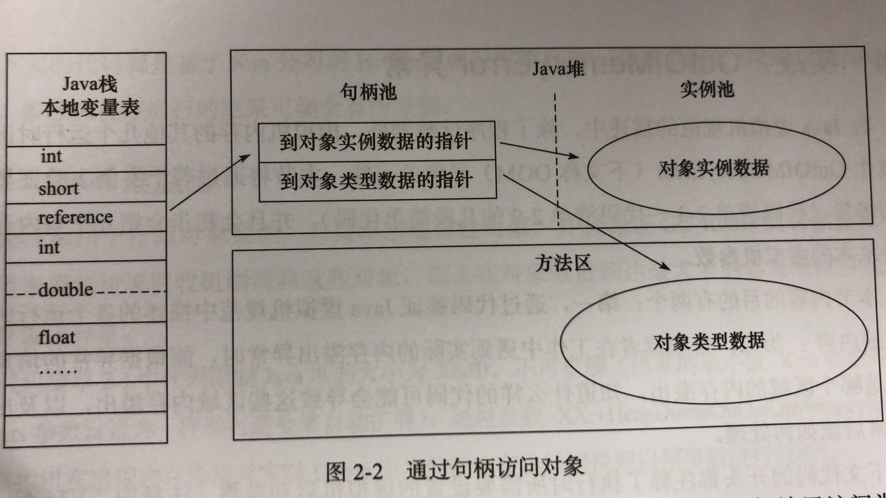
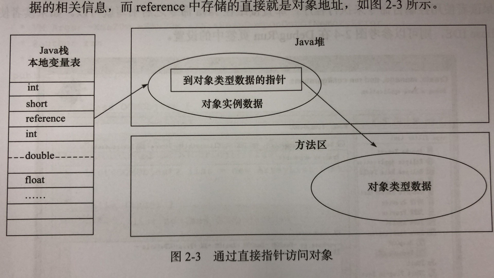

# 第2章

##2.1运行时数据区域

### 2.1

JVM运行时数据区域：

1. 程序计数器：**线程私有**，当前线程所执行的字节码的行号指示器，通过改变这个计数器的值选取下一条需要执行的字节码指令，分支、循环、跳转、异常处理、线程恢复等基础功能都需要依赖计数器完成。
2. Java虚拟机栈：**线程私有**，生命周期和线程相同。每个方法在执行时都会创建一个**栈帧**，用于**存储局部变量表、操作数栈、动态链接、方法出口**等信息。方法从调用到执行完成的过程，就是栈帧进栈出栈的过程。
3. 本地方法栈：类似于虚拟机栈，区别虚拟机栈为虚拟机执行Java方法，本地方法栈为虚拟机执行Native方法。
4. Java堆：**各线程共享**，存放**对象实例**，分配内存。垃圾收集器管理的主要区域，也叫GC堆。
5. 方法区：**各线程共享**，存储已被加载的**类信息、常量、静态变量、即时编译器编译后的代码等数据**。
6. 运行时常量池：是**方法区**的一部分。
7. 直接内存：特例，不是数据区域的一部分，也不是规范定义的内存区域，但被频繁使用。

##2.3对象

### 2.3.1对象的创建

1. 检查：遇到new指令，建厂这个指令的参数是否在常量池中定位到一个类的符号引用，检查是否被加载、解析、初始化，如果没有，先加载这个类。
2. 分配内存：计算大小。
3. 初始化：初始化零值。
4. 设置：哪个类的实例、元数据信息、哈希码等。

到第4步，虚拟机的工作已经完成，Java程序的工作刚刚开始（还未执行init方法）。

### 2.3.2对象的内存布局

* 对象头
  * **存储对象自身的运行时数据**，如哈希码、GC分代年龄、锁状态标志、线程持有的锁、偏向线程ID、偏向时间戳。
  * **类型指针**，对象指向他雷元数据的指针，虚拟机通过这个指针确定这个对象是哪个类的实例。
* 实例数据：真正有效的数据，字段呃逆荣。存储顺序收到**虚拟机分配策略参数**和**字段在源码中定义顺序**的影响。
  * 同宽字段被分配到一起
  * 父类定义的变量在子类前
* 对齐填充：占位符，对象大小必须是**8字节**的倍数

### 2.3.3对象的访问定位

Java程序通过栈上的reference数据操作对上的具体对象。

* 使用句柄访问：堆中划分出一块内存作为句柄池，reference中存储句柄的地址，句柄中存储实例数据和类型数据给字的地址信息。

  

* 使用直接指针访问：reference直接存储对象地址。

**两者比较**：

* 句柄：reference中存储的是稳定的句柄地址，在对象被移动时，只要改变对象实例数据的指针，reference本身不变。
* 指针：速度快，只要一次访问。

